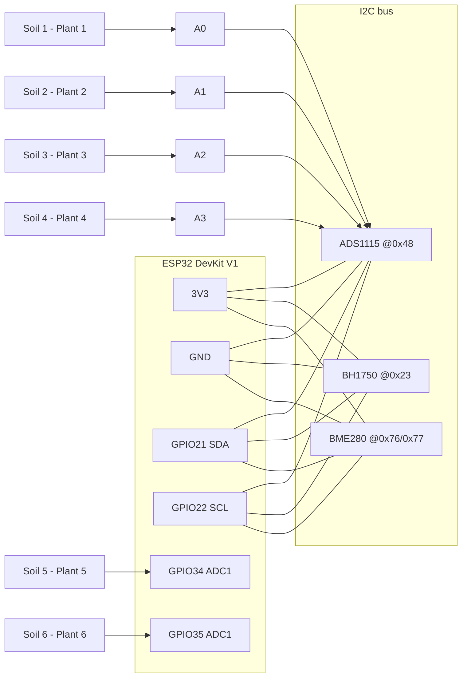

# Wiring Guide

All modules run on **3.3 V**. Never connect any sensor VCC to 5 V / VIN — the
analogue outputs would exceed what the ESP32 and ADS1115 inputs tolerate.

## Wiring table

### I2C bus (shared by ADS1115, BH1750, BME280)

| Module pin | Connect to | Notes |
|---|---|---|
| ADS1115 VDD | ESP32 3V3 | |
| ADS1115 GND | ESP32 GND | |
| ADS1115 SCL | ESP32 GPIO22 | shared I2C clock |
| ADS1115 SDA | ESP32 GPIO21 | shared I2C data |
| ADS1115 ADDR | ESP32 GND | sets address 0x48 |
| ADS1115 ALRT | — (leave unconnected) | |
| BH1750 VCC | ESP32 3V3 | |
| BH1750 GND | ESP32 GND | |
| BH1750 SCL | ESP32 GPIO22 | |
| BH1750 SDA | ESP32 GPIO21 | |
| BH1750 ADDR | — or GND | sets address 0x23 |
| BME280 VCC/VIN | ESP32 3V3 | |
| BME280 GND | ESP32 GND | |
| BME280 SCL | ESP32 GPIO22 | |
| BME280 SDA | ESP32 GPIO21 | |

Expected I2C addresses (verified by the firmware's startup scan):
ADS1115 `0x48`, BH1750 `0x23`, BME280 `0x76` or `0x77` (both are probed).

Most breakout boards include I2C pull-up resistors, so external pull-ups are
normally not needed. If the I2C scan finds nothing with correct wiring, add
4.7 kΩ pull-ups from SDA→3V3 and SCL→3V3.

### Soil moisture sensors

| Plant | Sensor signal (AOUT) | Sensor VCC | Sensor GND |
|---|---|---|---|
| Plant 1 | ADS1115 **A0** | 3V3 | GND |
| Plant 2 | ADS1115 **A1** | 3V3 | GND |
| Plant 3 | ADS1115 **A2** | 3V3 | GND |
| Plant 4 | ADS1115 **A3** | 3V3 | GND |
| Plant 5 | ESP32 **GPIO34** | 3V3 | GND |
| Plant 6 | ESP32 **GPIO35** | 3V3 | GND |

**Why GPIO34/35:** they are ADC1 pins. ADC2 pins (GPIO0/2/4/12–15/25–27)
stop working while Wi-Fi is active — do not move the soil sensors there.
GPIO34/35 are input-only, which is exactly what an analogue input needs.

### Power

| Connection | Notes |
|---|---|
| USB power supply → ESP32 micro-USB | powers everything |
| All GND pins | must share one common ground rail |
| All sensor VCC | from the 3V3 rail |

Six capacitive sensors draw roughly 5 mA each (~30 mA total) plus a few mA
per I2C module — well within the DevKit's 3.3 V regulator budget alongside
Wi-Fi.

## Connection diagram



ASCII fallback:

```
                         ┌──────────────────────┐
     USB 5V ────────────▶│   ESP32 DevKit V1    │
                         │                      │
   3.3V rail ◀───────────│ 3V3                  │
   GND rail  ◀───────────│ GND                  │
                         │                      │
        I2C SDA ─────────│ GPIO21               │
        I2C SCL ─────────│ GPIO22               │
                         │                      │
   Soil 5 AOUT ─────────▶│ GPIO34 (ADC1)        │
   Soil 6 AOUT ─────────▶│ GPIO35 (ADC1)        │
                         └──────────────────────┘

   I2C bus (SDA+SCL+3V3+GND to each module):
   ┌────────────┐   ┌───────────┐   ┌────────────┐
   │  ADS1115   │   │  BH1750   │   │   BME280   │
   │   0x48     │   │   0x23    │   │ 0x76/0x77  │
   │ ADDR→GND   │   │  (light)  │   │ (temp/hum) │
   └────────────┘   └───────────┘   └────────────┘
     ▲  ▲  ▲  ▲
     A0 A1 A2 A3
     │  │  │  │
   Soil1 2  3  4  (AOUT; VCC→3.3V, GND→GND for every soil sensor)
```
